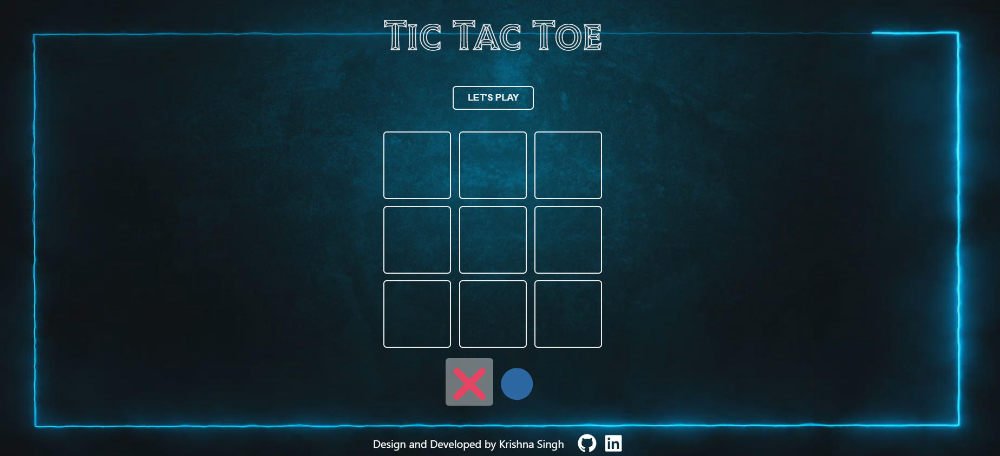
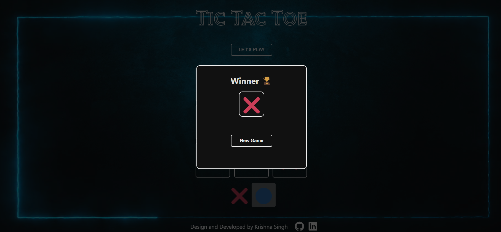

# Tic Tac Toe

Welcome to Tic Tac Toe! This is a classic Tic Tac Toe game with a sleek and modern design, developed by Krishna Singh.

## Table of Contents

- [Overview](#overview)
- [Features](#features)
- [Installation](#installation)
- [Usage](#usage)
- [Technologies](#technologies)
- [Screenshots](#screenshots)
- [Contributing](#contributing)
- [Contact](#contact)

## Overview

Tic Tac Toe is a simple and fun game for two players, X and O, who take turns marking the spaces in a 3×3 grid. The player who succeeds in placing three of their marks in a horizontal, vertical, or diagonal row wins the game.

## Features

- Two-player gameplay
- Interactive and responsive UI
- Easy to understand and play
- Modern and sleek design

## Installation

1. Clone the repository:

    ```bash
    git clone https://github.com/your-username/tic-tac-toe.git
    ```

2. Navigate to the project directory:

    ```bash
    cd tic-tac-toe
    ```

3. Install the dependencies:

    ```bash
    npm install
    ```

4. Start the development server:

    ```bash
    npm run dev
    ```

5. Open your browser and go to the provided local server address (typically `http://localhost:3000`).

## Usage

1. Click the "LET'S PLAY" button to start the game.
2. Players take turns clicking on the grid to place their X or O.
3. The game will announce the winner once a player has three of their marks in a row, column, or diagonal.
4. Refresh the page to play again.

## Technologies

- Vite
- HTML
- CSS
- JavaScript

## Screenshots

Main Page 



Winning Page



## Contributing

Contributions are welcome! Please fork the repository and create a pull request with your changes. Make sure to update tests as appropriate.


## Contact

Designed and developed by Krishna Singh. Feel free to reach out for any queries or collaboration.

- [GitHub](https://github.com/singhkrishna01)
- [LinkedIn](https://www.linkedin.com/in/krishnasingh20/)
- [Email](mailto:krishna00cs@gmail.com)

---
